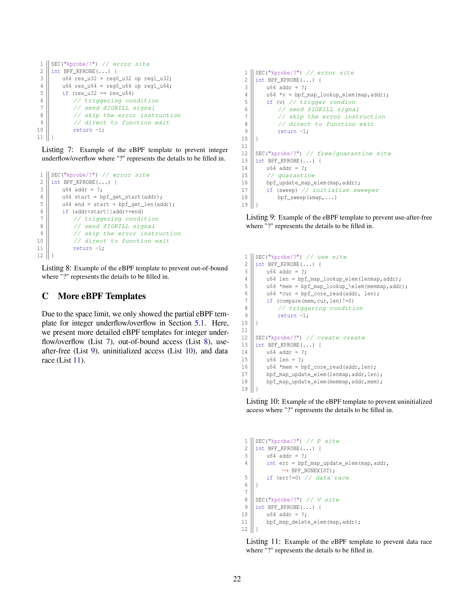

# PET

- oob: CVE-2016-6187
- uaf: CVE-2021-4154
- int: CVE-2017-7184
- race: syz
- uninit: 

The artifact include 3 parts, programs for evaluation, and the user guidance and source code for researchers who insterest our work.

To prove the effectiveness of our BPF error prevention program

we present 5 BPF programs to prevent 5 types of kernel errors from being triggered. we also present proof-of-concept alongside the errors.

we also provide compiled native and sanitized kernel images for runtime verification.

The types of errors including out-of-bound, use-after-free, integer overflow, data race, and uninitialization.

the provided programs support evaluating effectiveness of the POCs, we can run 3 of the proof-of-concepts in the sanitized kernel to get the sanitized report(including out-of-bound, use-after-free, integer overflow, uninitializations sanitizers hasn't been merged into upstream, and data race sanitizer does not provide proof-of-concepts)

the provided programs support evaluating effectiveness of the Then we start the qemu virtual machine to run POCs under the protection of BPF programs, results show that the kernel errors are prevented and the system run smoothly.

## more templates

