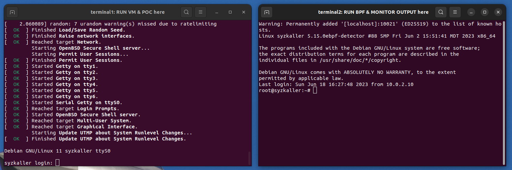

# PET

- [1-evaluation](./1-evaluation/): the artifact evaluation programs.
- [2-source-code](./2-source-code/): more implemtation details.
- [3-user-guidance](./3-user-guidance/): helper individuals develop new BPF prevention programs.

## abstract
This artifact is applying for a **"Artifacts Available" badge**. The artifact consists of three key components: evaluation programs, user guidance, and source code. These components are designed to provide a comprehensive understanding of our work and assist in the evaluation process. And the artifact evaluation mainly focuses on the effectiveness of the BPF prevention programs.

The evaluation programs included in the artifact are BPF prevention programs, Proofs-of-concepts, and compiled kernel images. These programs are intended to be run in the qemu virtual machine with the compiled kernel. By running the Proofs-of-concepts under the protection of the BPF prevention programs, evaluators can assess their effectiveness in preventing errors.

Furthermore, the artifact includes comprehensive user guidance. This guidance is meant to help individuals grasp the process of developing their own error prevention programs based on fuzz reports. It provides detailed instructions and explanations to support researchers in their own investigations.

Lastly, the artifact contains the source code. This encompasses a significant portion of the code used in our research, allowing researchers to delve deeper into the implementation details and potentially build upon our work.

In summary, the artifact provides valuable insights to enhance researchers' understanding of our work and facilitate further investigation of the PET framework. 

## set up
execute `evaluate.sh` to set up environment and pop up 2 terminals.

## evaluation

boot up BPF programs by executing `start-bpf-progs.sh` in *terminal 2*.

and execute proof-of-concepts in *terminal 1*.

## more templates

