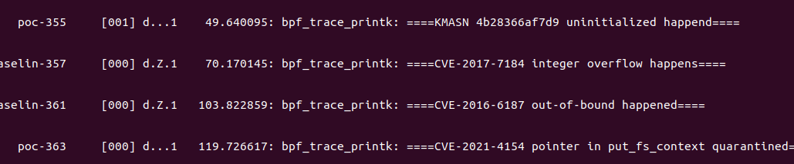

# PET

- [1-evaluation](./1-evaluation/): the artifact evaluation programs.
- [2-source-code](./2-source-code/): more implemtation details.
- [3-user-guidance](./3-user-guidance/): helper individuals develop new BPF prevention programs.

## abstract
<!-- This artifact is applying for a **"Artifacts Available" badge**. The artifact consists of three key components: evaluation programs, user guidance, and source code. These components are designed to provide a comprehensive understanding of our work and assist in the evaluation process. And the artifact evaluation mainly focuses on the effectiveness of the BPF prevention programs.

The evaluation programs included in the artifact are BPF prevention programs, Proofs-of-concepts, and compiled kernel images. These programs are intended to be run in the qemu virtual machine with the compiled kernel. By running the Proofs-of-concepts under the protection of the BPF prevention programs, evaluators can assess their effectiveness in preventing errors.

Furthermore, the artifact includes comprehensive user guidance. This guidance is meant to help individuals grasp the process of developing their own error prevention programs based on fuzz reports. It provides detailed instructions and explanations to support researchers in their own investigations.

Lastly, the artifact contains the source code. This encompasses a significant portion of the code used in our research, allowing researchers to delve deeper into the implementation details and potentially build upon our work.

In summary, the artifact provides valuable insights to enhance researchers' understanding of our work and facilitate further investigation of the PET framework.  -->

This artifact is applying for an Artifacts Available badge, an Artifacts Functional badge, and an Results Reproduced badge. It provides two main artifact sets for evaluators to reproduce PET. The first artifact set, detailed in Github, enables constructing PET from scratch, and the second artifact set includes kernel images and a root filesystem which allow the evaluator to reproduce our results in an isolated environment without any destructive steps.

Both artifact sets include Proof of Concept (PoC) programs and exploits of vulnerabilities used as test cases and eBPF programs that enable PET protection. After installing the eBPF program, the evaluator can execute the PoC programs and exploits to access the effectiveness of PET, by observing that the error triggering is prevented.

Besides we include user guidance in the first artifact set to help readers understand the design of PET, and develop their own eBPF programs for more error types that have not been covered in PET so far.

In conclusion, the evaluation includes 2 part
- functional: execute 5 types of vulnerabilities under the protection of BPF programs in the virtual machine, all the errors will be prevented and the system keep functioning.
- reproducible: 1) reproduce the performance overhead(about 14 hours), 2) adding new BPF programs from scratch.


## set up
Evaluators needs to``git clone https://github.com/purplewall1206/PET`, and download the `qemu root filesystem` and compiled kernel images from `https://tinyurl.com/2428uac5` in the same directory.

then evaluators needs to ensure `qemu, open-ssh` has been installed.

after that, evaluators can execute `evaluate.sh`, then the virtual machine will be started and 2 terminals will be pop up, there will be three
directories, including `bpf, PoCs, scripts`.



## functional evaluation

boot up BPF programs by executing `start-bpf-progs.sh` in *terminal 2*.

and execute proof-of-concepts in *terminal 1*.

- (E1): Test if the BPF program can prevent an integer overflow vulnerability CVE-2017-7184 from being triggered.
    - Execution: execute test-CVE-2017-7184.sh in *terminal 1*
    - Results: There will be killed signal in *terminal 1*, and there will be a report `====CVE-2017-7184 is happened====` in *terminal 2*.
- (E2): Test if the BPF program can prevent an out-of-bound vulnerability CVE-2016-6187 from being triggered.
    - Execution: execute test-CVE-2016-6187.sh in terminal 1
    - Results: There will be killed signal in terminal 1, and there will be a report ====CVE-2016-6187 is happened==== in terminal 2.
- (E3): Test if the BPF program can prevent an use-after-free vulnerability CVE-2021-4154 from being triggered.
    - Execution: execute test-CVE-2021-4154.sh in terminal 1
    - Results: Because of the quarantine & sweep policy, the dangling pointer of a use-after-free vulnerability will be quarantined, the vulnerability will not be triggered. Proof-of-concept in terminal 1 cannot trigger the vulner- ability, and terminal 2 will report dangling pointers are quarantined.
- (E4): Test if the BPF program can prevent an uninitialization vulnerability kmsan-4b28366af7d9 from being triggered.
    - Execution: execute test-kmsan_4b28366af7d9.sh in terminal 1
    - Results: The vulnerability is triggered in terminal1 under an conservative check policy, it means that the BPF program will catch the uninitialization memory but not kill the process. There will be reports ====kmsan-4b28366af7d9 is happened==== in terminal 2.
- (E5): Test if the BPF program can prevent a data race vulnerability kcsan-dcf8e5633e2e from being triggered.
    - Execution: KCSAN does not provide proof-of-concept,so no proof-of-concept is executed in terminal 1.
    - Results: The BPF program detector_kcsan_dcf8e5633e2ewill be keep checking if the vulnerability kcsan-dcf8e5633e2e is being triggered.


## reproducible evaluation

### performance overhead

after the functional evaluation, execute `/root/scripts/phoro-run.sh`, 7 performance tests with `phoronix-test-suites` will be executed, 7 seperate performance tests are queued to be executed, including the vanilla, system protected by 5 BPF program individually and simultaneously.

execute `phoronix-test-suites result-file-to-text evaluation-*`, the results will be outputed.

**attention: it will takes at least 2 hours for one test, and 14 hours in total** 


### generate a new BPF program to prevent vulnerability from being triggered.

more examples are in [user guidance](./2-).

There are mainly *x* steps to generate BPF program from scratch, we take a public available and fixed vulerability, CVE-20xx-xxxx as example

#### 1. get the bug report

First of all, evaluators need get bug report from sanitized kernel, we have prepared the proof-of-concept in the environment.

Evaluators can boot up sanitized kernel by running `run-kasan.sh`, then execute `./scripts/test-CVE-20xx-xxxx.sh`, the bug report will be export to the *terminal 1*.
after that, evaluators need to copy the bug report and paste in the file `CVE-20xx-xxxx.report`.

```

```


#### 2. extract critical information and generate program

According to the error dependant policies in section *5.3 Use-After-Free Policy*, and the error independant policies in section *6 Error-independent Mechanisms*.

PET needs to get the free position than may conduct dangling pointers from bug report, including *function* that calls memory free function, and *offset* from *call kfree* to *function* start.
Evaluators can execute `python3 extract-uaf.py  CVE-20xx-xxxx.report` to get extract the critical information.
```sh
$ python3 extract-uaf-report.py CVE-2019-18344.report 
BUG: KASAN: use-after-free in vid_cap_buf_queue+0xa2/0xc0
 __vb2_queue_free+0x26f/0x360
 __vb2_queue_free


$ python3 extract-uaf-binary.py  __vb2_queue_free
__vb2_queue_free: 0xffffffff8193c420
the function that call: 0xffffffff8193c55e
offset: 0x13e
```

after that, evaluator take the critical information as input, execute `python3 gen-uaf.py CVE-20xx-xxxx function offset`.

2 files will be generated in the directory `/pet/linux-5.15-vulns/samples/bpf`, `detector_CVE-20xx-xxxx-evaluation.bpf.c` and `detector_CVE-20xx-xxxx-evaluation.c`

```sh
$ python3 gen-uaf.py  __vb2_queue  CVE-2019-18344  0x13e  <path-to-kernel>/sample/bpf
```

#### 3. compile the BPF program

first of all, evaluators needs to add compile instructions in the `/pet/linux-5.15-vulns/samples/bpf/Makefile`.
- `tprogs-y+=detector_CVE-20xx-xxxx-evaluation.o`
- `detector_CVE-20xx-xxxx-evaluation-objs+=detector_CVE-20xx-xxxx-evaluation`
- `always-y+=detector_CVE-20xx-xxxx-evaluation.bpf.o`

**for easy, we have already add them in the Makefile**

after file generated, evaluators need to copy the entire kernel in the virtual machine. 
execute `reproduce.sh` to start 2 terminals same as in the *functional evaluation*, and the entire kernel source will be copied in the virtual machine.

after that, executors can `mv` to the `/pet/linux-5.15-vulns/samples/bpf` in both terminals, and execute `make -j2` to compile the program.


#### 4. functional tests

similar the the previous functional evaluation, evaluators can run `/pet/linux-5.15-vulns/samples/bpf/detector_CVE-20xx-xxxx-evaluation` in *terminal 2*

and execute proof-of-concept in `/root/CVE-20xx-xxxx/poc` in the *terminal 1*, results will be presented in *terminal 2*, dangling pointer will be quarantined.


## more templates

